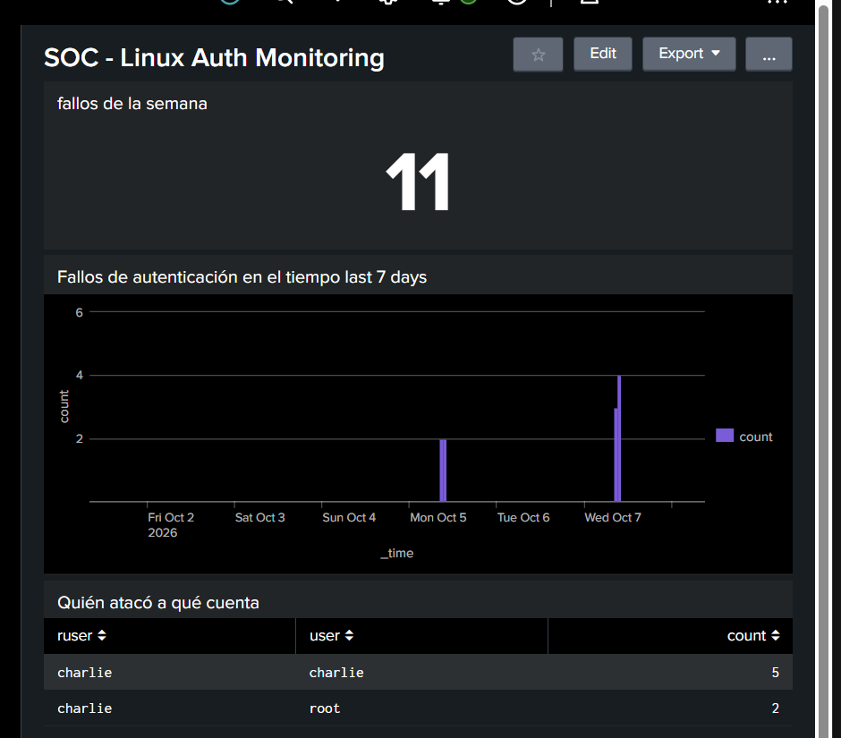
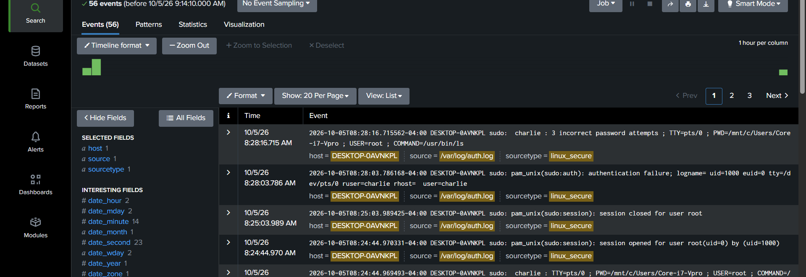
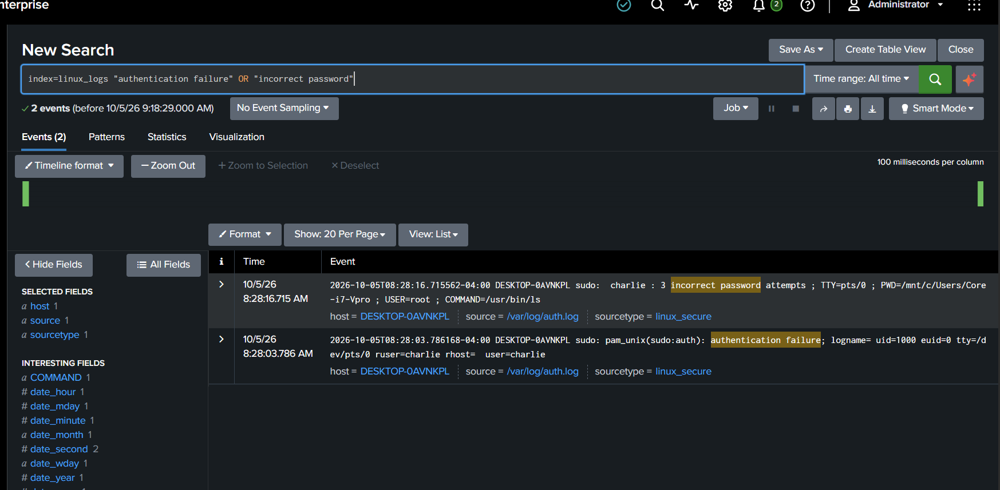
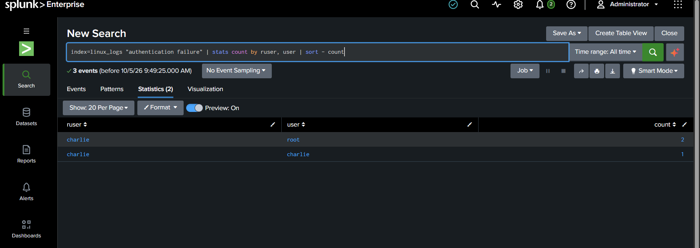
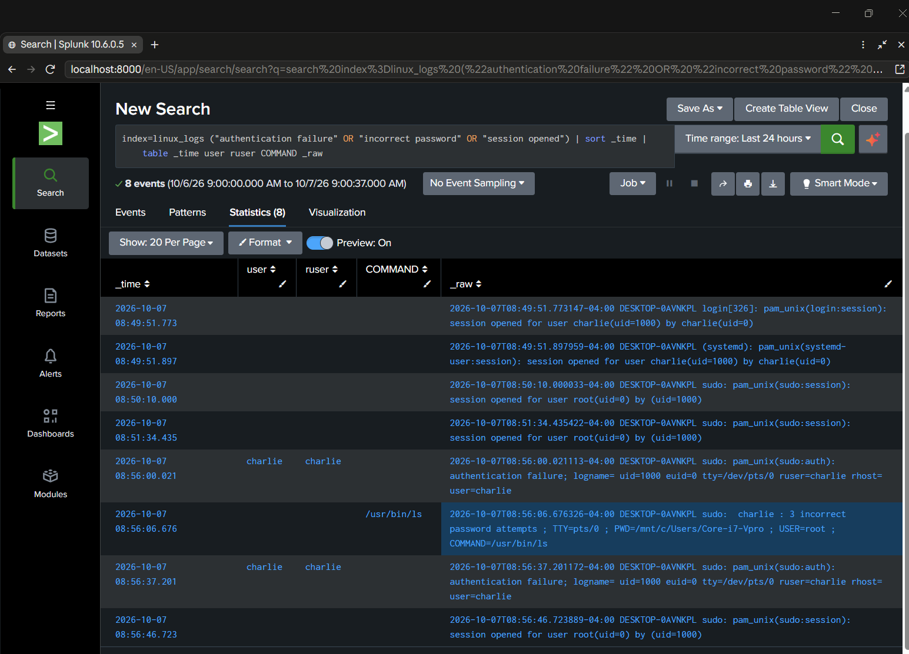
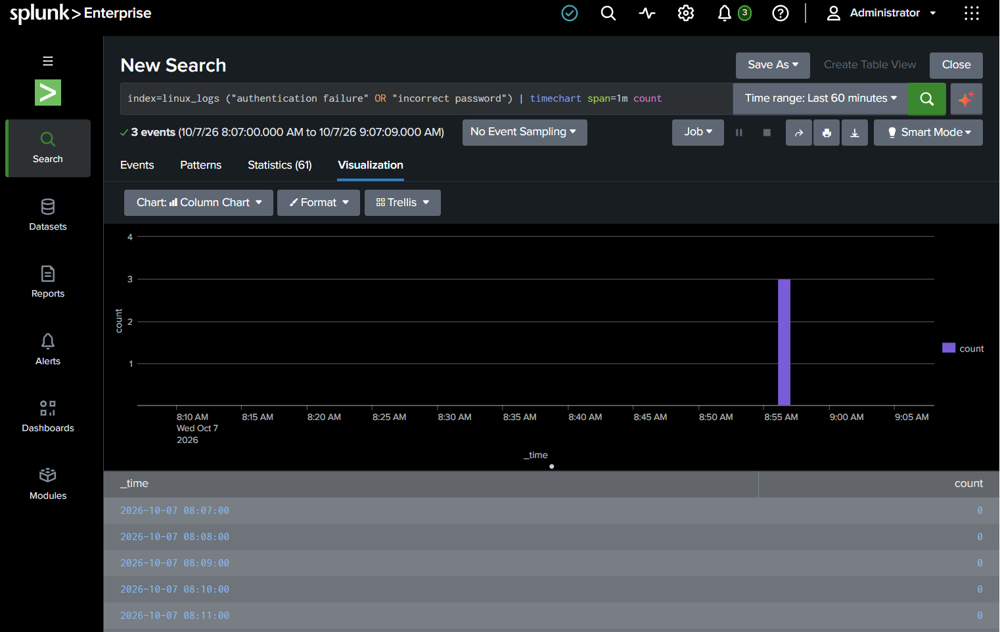
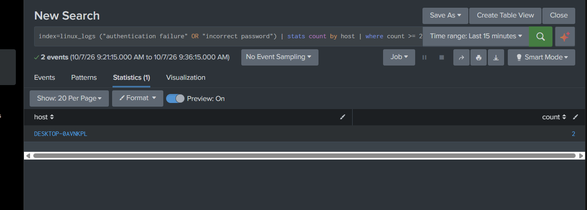
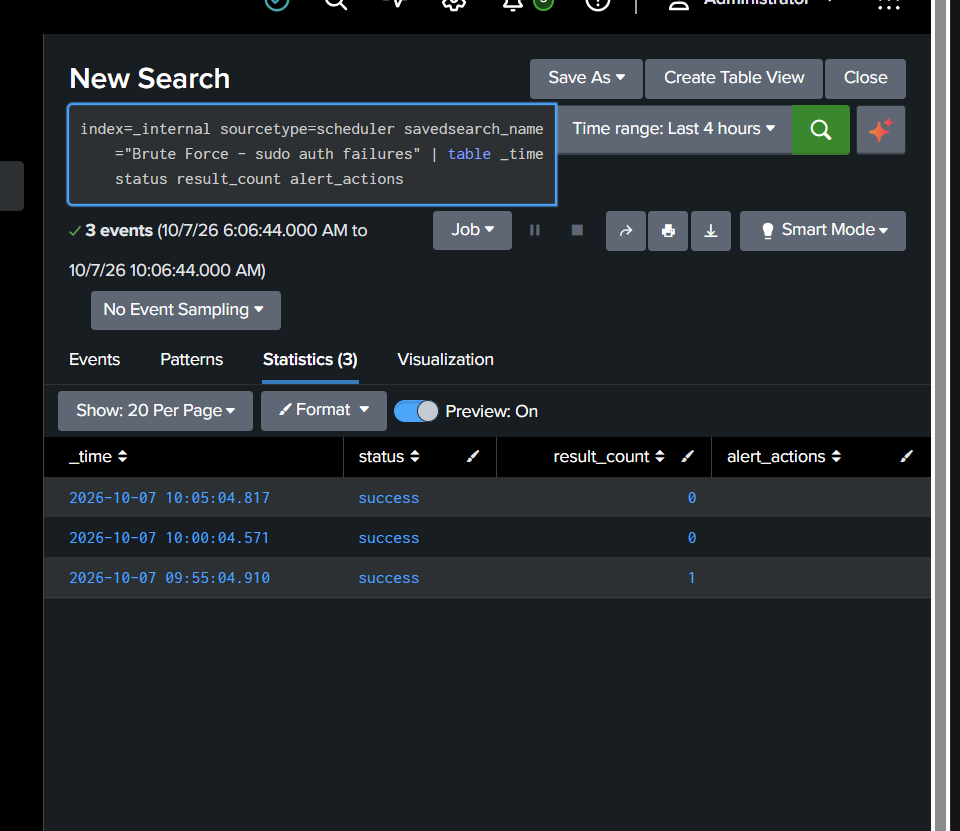

# Splunk SIEM — Linux sudo Brute-Force Detection

- **Author:** Charlie Figueroa
- **Tools:** Splunk Enterprise 10.6.0.5 · Ubuntu on WSL2 · SPL · Linux `auth.log`
- **Skills shown:** log ingestion, SPL searching, alert triage, timeline reconstruction, detection engineering (scheduled alerts), SIEM troubleshooting, dashboarding



---

## Summary

I built a home SOC lab with Splunk Enterprise running on Linux (WSL2), ingested the system authentication log (`/var/log/auth.log`), and simulated privilege-escalation brute-force attempts with `sudo` and `su`. I then worked the case end to end like a Tier 1 analyst: searched and filtered the events, reconstructed the attack timeline, confirmed when the "attacker" obtained a root session, built a scheduled detection alert, verified that it fired, and created a monitoring dashboard.

> All activity was generated by me in a controlled lab. No real systems or third-party data were involved.

---

## 1. Lab setup & ingestion

| Item | Value |
|---|---|
| SIEM | Splunk Enterprise 10.6.0.5 (trial), installed in `/opt/splunk` on Ubuntu (WSL2) |
| Data source | `/var/log/auth.log` — monitored continuously |
| Index | `linux_logs` (custom) |
| Sourcetype | `linux_secure` |

56 events were ingested on first load. Continuous monitoring was confirmed when the count grew on its own (56 → 58) as new lines were written.



## 2. Simulated attack

- `sudo -k` + `sudo ls` with wrong passwords → failed privilege escalation attempts as root.
- `su root` with wrong passwords → direct attempts to become root.
- A final run with wrong passwords followed by the correct one → **failed attempts followed by a successful root session** (the pattern that means the attack worked).

## 3. Detection & investigation

**Filtering the signal from the noise** — from 56 events down to 2:

```spl
index=linux_logs ("authentication failure" OR "incorrect password")
```


**Target account vs. requesting user.** In PAM logs, `user=` is the *target* account and `ruser=` is *who requested it*. Counting by `user` alone suggested "root was attacked"; adding `ruser` showed the same local user was behind both:

```spl
index=linux_logs "authentication failure" | stats count by ruser, user | sort - count
```


**Timeline reconstruction (did the attacker get in?)**

```spl
index=linux_logs ("authentication failure" OR "incorrect password" OR "session opened")
| sort _time | table _time user ruser COMMAND _raw
```

| Time | Event | Analyst reading |
|---|---|---|
| 08:49–08:51 | `session opened` (login, systemd, sudo) | Normal activity (lab startup) — noise |
| 08:56:00 | `pam_unix(sudo:auth): authentication failure ... user=charlie` | First failure |
| 08:56:06 | `charlie : 3 incorrect password attempts ; COMMAND=/usr/bin/ls` | 3 failures in 6 s |
| 08:56:37 | `authentication failure ... user=charlie` | New attempt |
| 08:56:46 | `session opened for user root(uid=0) by (uid=1000)` | **Root session obtained → escalate** |



**Attack over time** — flat baseline with a clear spike:



### Key finding: log lines ≠ attempts
PAM writes **only the first failure** of each `sudo` invocation as `authentication failure`; the rest are summarized in a single `N incorrect password attempts` line. Three real attempts produced only two log lines. Counting only `"authentication failure"` **under-reports the attack**, so detections must include the summary line and thresholds must be set with this in mind.

## 4. Scheduled alert

| Setting | Value |
|---|---|
| Name | `Brute Force - sudo auth failures` |
| Search | `index=linux_logs ("authentication failure" OR "incorrect password") \| stats count by host \| where count >= 2` |
| Schedule | cron `*/5 * * * *`, time range = last 5 minutes (window aligned with frequency → no gaps, no duplicates) |
| Trigger | Number of results > 0, once |
| Action / Severity | Add to Triggered Alerts / High |

Threshold rationale: 3 real attempts generate 2 log lines, so `>= 2` catches a short burst while ignoring a single typo.



**Verifying the alert actually fired** — when the alert seemed silent, I checked Splunk's internal scheduler log instead of assuming it was broken:

```spl
index=_internal sourcetype=scheduler savedsearch_name="Brute Force - sudo auth failures"
| table _time status result_count alert_actions
```

The 09:55 run returned `result_count = 1` (fired); the following runs returned 0 (no duplicate alerts).



### Triage note (ticket)
> Alert "Brute Force - sudo auth failures" (High). Host DESKTOP-0AVNKPL. User charlie (uid 1000) generated 2 sudo failure lines (3 attempts) trying to run `/usr/bin/ls` as root. No root session immediately after this burst. Activity confirmed as a controlled lab test → benign, closed and documented. In production: verify with the user and monitor; if a root session follows the failures → escalate as an incident.

## 5. Monitoring dashboard — "SOC - Linux Auth Monitoring"

| Panel | Purpose |
|---|---|
| Single value (failures this week) | How much? |
| Column chart (failures per hour, 7 days) | When? Baseline vs. spikes |
| Table (`ruser` → `user`) | Who, against which account? |

**Lesson learned:** two panels with different time ranges tell different stories and nothing on screen warns you. One panel defaulted to 24 h and hid the `su root` attempts from earlier in the week. Fixed by pinning `earliest=-7d` inside every panel search.

## 6. MITRE ATT&CK mapping

| Technique | ID | Evidence |
|---|---|---|
| Brute Force: Password Guessing | T1110.001 | Repeated wrong passwords for `sudo` / `su` |
| Abuse Elevation Control Mechanism: Sudo and Sudo Caching | T1548.003 | Attempts to run commands as root via `sudo` |

## 7. Takeaways

- **The key SOC question is "did they get in?"** Failures alone → monitor. Failures followed by a success → escalate.
- Know how each system writes its logs before writing a detection (PAM line vs. attempt count).
- Align alert time range with schedule frequency to avoid gaps and duplicate alerts.
- When a tool "doesn't work", look for evidence (`_internal`) before concluding.
- A SIEM outage is a visibility gap: forwarders buffer data, and the gap must be documented.

All SPL used in this project: [`detection_queries.spl`](detection_queries.spl)

*AI assistance: I used Claude as a study coach and troubleshooting aid during this lab; every search and result shown was run and validated in Splunk.*
